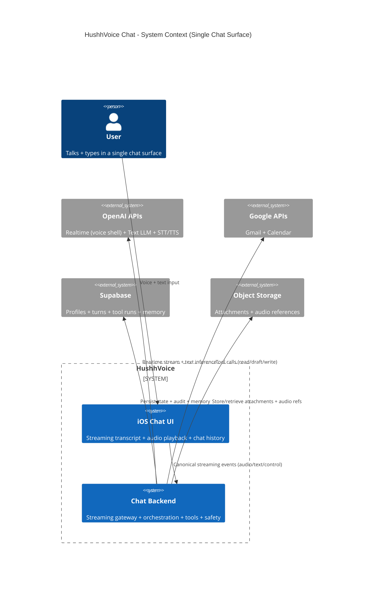
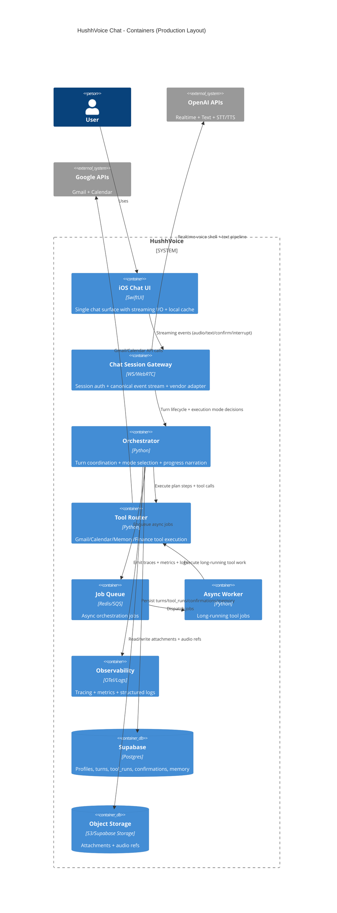
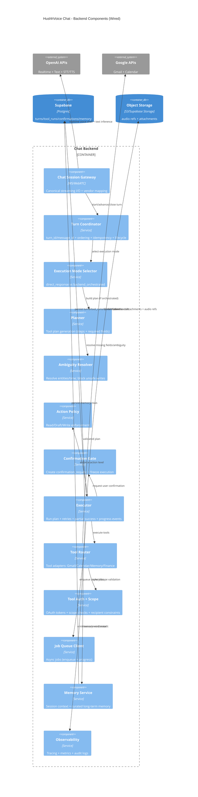
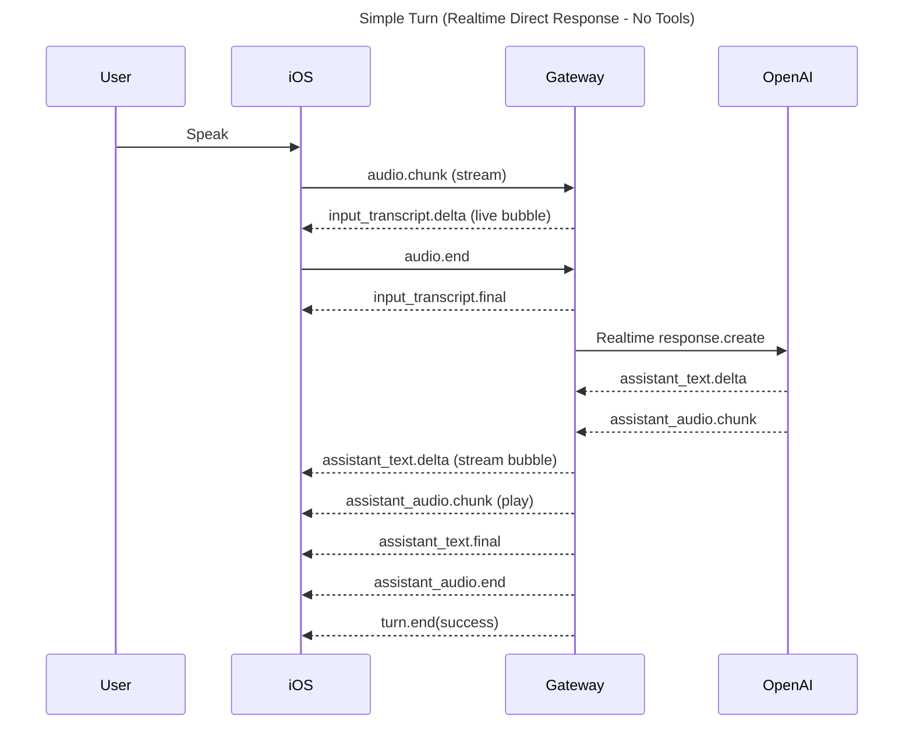
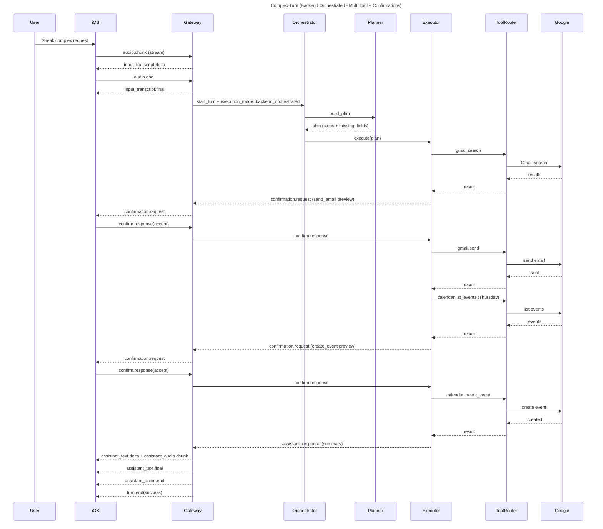

# HushhVoice Chat - Architecture & Design Plan (v1)

This document defines the v1 architecture for the HushhVoice chat surface. It is a single chat UI (no separate voice mode screen) that supports voice-first interaction, typing, attachments, and streaming text+audio. The system uses Realtime as the always-on voice shell when healthy, and a backend orchestrator for safe, deterministic tool execution.

Inspiration: ChatGPT voice mode, with a single chat surface that feels like a live call.

## 0) Goals and Non-Goals

### Goals
- Single chat surface (no separate "voice mode" screen).
- Voice-first but fully supports typing and attachments.
- Streaming everywhere:
  - User speech -> streaming transcript appears in a user bubble while speaking.
  - Assistant response -> streaming text appears in an assistant bubble while assistant audio plays.
- Realtime is the always-on voice shell when healthy (low latency).
- Backend decides execution mode per turn:
  - `direct_response` for simple tasks.
  - `backend_orchestrated` for multi-tool/ambiguous/write/long tasks.
- Tool calls centralized server-side: Gmail, Calendar, Memory, future Finance.
- Strong safety + correctness:
  - Action policy (read/draft/write).
  - Ambiguity resolver before writes.
  - Confirmation gate for writes.
  - Turn coordinator for ordering/idempotency.
  - Audit + observability first-class.

### Non-Goals (v1)
- Video / screen share.
- Full emotion prosody / multiple voices beyond baseline.
- On-device MLX inference (can be v2; architecture allows it).
- Perfect real-time alignment between text and audio (close sync is enough).

## 1) UX / UI Requirements (Chat Surface)

### Chat list
- Displays message bubbles:
  - User (typed or transcribed speech)
  - Assistant (text streamed + speaks automatically)
- Each assistant message has:
  - Copy button
  - Replay (speak again) button

### Input bar (bottom)
Left -> right:
- "+" attachment button
- Expandable text field
  - Default small height
  - Expands vertically as user types (max height; then scroll inside)
- Mic mute/unmute toggle
  - Controls whether mic is actively capturing audio
  - "Muted" means no audio chunks are sent; can still type

### Voice experience
- User speaks -> transcript streams into a live "draft" user message.
- On end-of-utterance, draft becomes final message.
- Assistant auto-responds (voice + streamed text).
- Barge-in (minimal v1):
  - If user starts speaking while assistant speaking: stop assistant audio locally + send `user.interrupt`.

## 2) System Architecture (High Level)

### Core idea
- Realtime = voice shell (audio transport + streaming transcript + assistant audio/text).
- Backend orchestrator handles tools, planning, confirmations, audit, idempotency.
- iOS speaks canonical events; backend maps to vendor-specific Realtime events.

### Components
Client (iOS)
- Chat UI + message store (local)
- Audio capture + playback
- State machine controlling UX
- Streaming event client (WebSocket or WebRTC to Gateway)

Backend
- Chat Session Gateway (streaming)
- Turn Coordinator (ordering, dedupe, lifecycle)
- Execution Mode Selector (direct vs orchestrated)
- Planner + Executor
- Ambiguity Resolver
- Action Policy
- Confirmation Gate
- Tool Router + Tool Auth/Scope
- Job Queue + Async Worker
- Observability

Data
- Supabase tables (profile, onboarding, sessions, turns, tool_runs, confirmations, memory, optional chat history)

## 3) Runtime: Client State Machine

### States
- idle: no active turn
- listening: mic active; streaming transcript deltas
- finalizing_input: end-of-utterance, finalize transcript + route decision
- thinking: backend planning (or direct model "thinking")
- executing_tools: backend executing tool chain
- awaiting_confirmation: waiting for user confirm/edit/cancel
- speaking: assistant audio playing + text streaming
- cancelled: previous turn cancelled due to barge-in
- error_recoverable: can retry/fallback
- error_terminal: stop turn, show error

### State transitions (summary)
- idle -> listening on mic unmute + push-to-talk/auto-detect
- listening -> finalizing_input on speech end / audio end
- finalizing_input -> thinking after transcript final
- thinking -> executing_tools (if orchestrated tool chain)
- executing_tools -> awaiting_confirmation (if write action gate)
- awaiting_confirmation -> executing_tools (after confirmation)
- thinking/executing_tools -> speaking when assistant starts output
- speaking -> idle when assistant done
- speaking -> cancelled on barge-in interrupt

## 4) Canonical Streaming Event Protocol (iOS <-> Backend)

### Envelope (every event)
```json
{
  "event_id": "evt_123",
  "event_type": "assistant_text.delta",
  "ts": "2026-01-17T12:34:56.789Z",
  "session_id": "sess_abc",
  "turn_id": "turn_001",
  "message_id": "msg_001",
  "seq": 17,
  "turn_seq": 4,
  "role": "assistant",
  "payload": {}
}
```

### Rules
- `seq`: monotonic per session stream
- `turn_seq`: monotonic per turn
- `turn_id`: idempotency anchor for a user "turn"
- Client must handle out-of-order delivery by sorting `(turn_id, turn_seq)` when needed, but backend should enforce order.

### Client -> Server events
- `audio.chunk`
  ```json
  { "pcm16_b64": "...", "sample_rate": 48000, "channels": 1 }
  ```
- `audio.end`
  ```json
  { "reason": "end_of_speech|manual_stop|timeout" }
  ```
- `text.input`
  ```json
  { "text": "...", "source": "keyboard", "attachments": ["file_123"] }
  ```
- `confirm.response`
  ```json
  {
    "confirmation_request_id": "cr_123",
    "decision": "accept|reject|edit",
    "edited_payload": {}
  }
  ```
- `user.interrupt`
  ```json
  { "reason": "barge_in", "cancel_turn_id": "turn_001" }
  ```
- `session.ping`
  ```json
  { "client_ts": "..." }
  ```

### Server -> Client events
Turn + state:
- `turn.start` `{ "input_mode": "voice|text" }`
- `state.change` `{ "from": "...", "to": "...", "reason": "..." }`
- `turn.end` `{ "outcome": "success|partial|failed", "error_code": null }`
- `turn.cancelled` `{ "cancel_turn_id": "turn_001" }`

Transcripts:
- `input_transcript.delta` `{ "text": "...", "confidence": 0.82 }`
- `input_transcript.final` `{ "text": "...", "confidence": 0.91 }`

Assistant stream:
- `assistant_text.delta` `{ "text": "..." }`
- `assistant_text.final` `{ "text": "..." }`
- `assistant_audio.start` `{ "audio_format": "pcm16", "sample_rate": 24000 }`
- `assistant_audio.chunk` `{ "pcm16_b64": "...", "start_ms": 1200, "duration_ms": 240 }`
- `assistant_audio.end` `{}`

Tools:
- `tool_call.request` `{ "call_id": "...", "tool_name": "...", "arguments": {}, "idempotency_key": "...", "mode": "direct|orchestrated" }`
- `tool_call.queued` `{ "call_id": "...", "job_id": "...", "message": "Queued" }`
- `tool_call.progress` `{ "call_id": "...", "status": "running", "progress": 0.4, "message": "Fetching inbox..." }`
- `tool_call.result` `{ "call_id": "...", "ok": true, "output": {}, "error": null }`

Confirmation:
- `confirmation.request` `{ "confirmation_request_id": "...", "action_type": "send_email|create_event", "preview": {} }`

Rate limiting / errors:
- `rate_limit` `{ "scope": "audio|tool|model", "retry_after_ms": 1000 }`
- `error` `{ "code": "realtime_timeout", "message": "...", "retryable": true }`

## 5) Backend Services (Detailed)

### 5.1 Chat Session Gateway
Responsibilities:
- Maintains session with client (`session_id`)
- Streams canonical events
- Bridges to Realtime provider (WebRTC/WS) and/or text pipeline
- Emits `turn.start`, `state.change`, streaming deltas

Contracts:
- Input: canonical client events
- Output: canonical server events
- Auth: session token from iOS, resolves `user_id`

### 5.2 Turn Coordinator (must-have)
Responsibilities:
- Generates/validates:
  - `turn_id`, `message_id`, `request_id`, `trace_id`
- Enforces ordering
- Dedupes by idempotency keys
- Stores turn lifecycle (`turns` table)
- Ensures "exactly-once" semantics for write actions (as close as possible)

Key functions:
- `start_turn(user_id, thread_id, input_mode)`
- `set_state(turn_id, state)`
- `register_tool_call(turn_id, idempotency_key, tool_name, input_hash)`
- `complete_turn(turn_id, outcome)`

### 5.3 Execution Mode Selector
Inputs:
- Realtime health: RTT/jitter, disconnects
- Tool complexity estimate
- Action type classification: read/draft/write
- Ambiguity score
- Long-running expectation

Outputs:
- `pipeline`: realtime or classic_fallback
- `execution_mode`: direct_response or backend_orchestrated

Rules:
- If Realtime unhealthy -> classic_fallback for that turn
- Else always keep Realtime shell
- backend_orchestrated if:
  - 2+ tools OR
  - any write action OR
  - ambiguity detected OR
  - long-running jobs

### 5.4 Planner
Purpose:
- Convert user intent into a tool plan: ordered steps with required args and confirmation requirements.

Output format:
```json
{
  "plan_id": "plan_123",
  "steps": [
    { "step_index": 1, "tool": "gmail.search", "args": { "query": "..." }, "action_level": "read", "requires_confirmation": false },
    { "step_index": 2, "tool": "gmail.draft_reply", "args": { "...": "..." }, "action_level": "draft", "requires_confirmation": false },
    { "step_index": 3, "tool": "gmail.send", "args": { "...": "..." }, "action_level": "write", "requires_confirmation": true }
  ],
  "missing_fields": ["recipient_email"],
  "ambiguity": { "recipient_candidates": ["..."] }
}
```

### 5.5 Ambiguity Resolver (mandatory before writes)
Purpose:
- Normalize entities and block unsafe actions:
  - "him" -> concrete email address
  - "Thursday" -> time window + timezone + duration
  - meeting details: title, attendees, preferred hours
- If missing/ambiguous:
  - emit `confirmation.request` or ask a follow-up question (in chat), and freeze execution.

### 5.6 Action Policy
Defines what can happen automatically:
- read: auto
- draft: auto + show preview
- write: must confirm unless user explicitly opted into "auto-execute writes" (v2 setting)

### 5.7 Confirmation Gate
Mechanism:
- Creates `confirmation_request_id`
- Persists request in `confirmation_requests`
- Executor halts until:
  - accept / reject / edit arrives
- If timeout -> mark expired and ask user to retry

### 5.8 Executor
Responsibilities:
- Runs the plan.
- Executes tools sequentially or in safe parallel (reads can parallelize).
- Emits `tool_call.*` events.
- Handles retries for transient failures.
- Records every tool run in `tool_runs`.
- Produces final assistant response summary.

Partial success:
- If some steps succeed and later fail, the assistant must clearly say what happened and what did not.

### 5.9 Tool Router + Tool Auth/Scope
Tool Router:
- Unified interface: `run_tool(tool_name, args, user_id, turn_id)`
- Returns result or job_id

Tool Auth/Scope:
- OAuth token retrieval + refresh (encrypted at rest)
- Validates scopes before any tool call
- Recipient safety:
  - must match explicit email OR contact OR recent thread participant

### 5.10 Job Queue + Async Worker
For long tasks:
- Summarize many emails
- Download + parse attachments
- Big multi-step retrieval

Flow:
- Tool Router enqueues job -> returns job_id
- Worker processes -> streams progress to Gateway
- Gateway emits `tool_call.progress/complete`

### 5.11 Observability
Per turn:
- end_of_speech -> first_audio_byte latency
- tool latency per tool
- fallback rate
- tool failure rate
- idempotency dedupe hits
- transcript drift estimate

Logs:
- `trace_id`, `session_id`, `turn_id`, `request_id`

## 6) Data Storage: Supabase + On-Device

### 6.1 Supabase tables (server-side)
Minimum required for v1:
- `user_profile`
- `onboarding_state`
- `oauth_tokens` (if server manages tokens)
- `sessions`
- `turns`
- `tool_runs`
- `confirmation_requests`
- `memories`

Optional:
- `chat_threads`, `chat_messages` (if you want cross-device or analytics)

### 6.2 On-device storage
Store locally for performance + offline scroll:
- Chat cache (last N messages per thread)
- Drafts + partial transcript deltas
- UI preferences
- Local onboarding cache
- Audio replay cache references (optional)

Security note:
- Tokens should ideally be in Keychain; App Group UserDefaults is not ideal for secrets. Use Keychain if possible.

## 7) End-to-End Turn Flows

### 7.1 Simple voice question (no tools)
- iOS streams `audio.chunk` -> live transcript via `input_transcript.delta`
- `audio.end` -> `input_transcript.final`
- Selector picks `direct_response`
- Realtime model generates response
- Server streams `assistant_text.delta` + `assistant_audio.*`
- `assistant_text.final` -> `turn.end(success)`
- iOS stores final messages to local cache (and optionally server)

### 7.2 Simple read-only tool (one tool)
Example: "What meetings do I have tomorrow?"
- Execution: direct_response + single read tool
- Model requests tool -> Tool Router returns events
- Assistant summarizes and speaks

### 7.3 Complex multi-tool + writes + ambiguity
Example: "Check my email, reply to him, schedule a meeting Thursday."
Phase A: Ingest
- Voice -> transcript streams
Phase B: Orchestration
- Selector -> backend_orchestrated
Planner steps:
- `gmail.search`
- resolve "him" -> may require follow-up if multiple candidates
- draft reply
- confirm send
- `calendar.list` Thursday availability
- propose slot
- confirm schedule
- `calendar.create_event`
Phase C: Confirmations
- For send/create: emit `confirmation.request`
- UI shows confirmation card with preview (email subject/body; meeting details)
- actions: Confirm / Edit / Cancel
Phase D: Completion
- After confirmations, executor completes
- Assistant speaks summary + streams text
- Persist:
  - `turns` outcome = success/partial
  - `tool_runs` records
  - `confirmation_requests` resolved
  - optional memory updates (only if policy passes)

## 8) Turn Lifecycle (Concrete)

| State | Entered when | Emits | Exit |
| --- | --- | --- | --- |
| idle | no active turn | -- | audio/text input |
| listening | mic active | input_transcript.delta | speech stopped |
| finalizing_input | audio end | input_transcript.final | selector decision |
| thinking | planning | state.change | plan ready |
| executing_tools | running tools | tool_call.* | done / confirm |
| awaiting_confirmation | write gated | confirmation.request | confirm response / timeout |
| speaking | assistant output | assistant_text/audio | assistant final |
| cancelled | barge-in | turn.cancelled | new turn |
| error_recoverable | retryable | error | retry/fallback |
| error_terminal | fatal | error | idle |

## 9) API Surfaces (Implementation Guidance)

### 9.1 Gateway streaming endpoint
Choose one:
- WebSocket for canonical events (easier)
- WebRTC if you want ultra-low latency audio; still can tunnel canonical events via data channel

WS example:
```
wss://api.hushh.ai/chat/stream?session_token=...&thread_id=...
```

### 9.2 REST endpoints (supporting)
- `POST /chat/session/start` -> returns `session_id` and stream URL
- `POST /chat/attachment/upload` -> returns `file_id`, metadata
- `POST /chat/confirm` (optional if confirmations not sent via stream)

### 9.3 Tool Router internal interface
- `POST /tools/run`
  ```json
  { "user_id": "...", "turn_id": "...", "tool_name": "...", "args": {}, "idempotency_key": "..." }
  ```

### 9.4 Memory service internal interface
- `GET /memory/retrieve?user_id=...&context=...`
- `POST /memory/write` (policy-gated)

## 10) Tool Set (v1)

Gmail:
- `gmail.search(query, max_results)`
- `gmail.get_message(message_id)` (if needed)
- `gmail.draft_reply(thread_id/message_id, intent, tone)`
- `gmail.send(to, subject, body)` (write)

Calendar:
- `calendar.list_events(date_range)`
- `calendar.find_free_slots(date_range, duration, constraints)`
- `calendar.create_event(start, end, title, attendees)` (write)

Memory:
- `memory.retrieve(context)`
- `memory.suggest_write(candidate_memory)` (asks user)
- `memory.write(memory)` (after confirmation)

## 11) Safety / Policy Rules (Must Implement)
- Write actions always gated:
  - send email
  - create event
  - delete anything
  - any financial action (future)
- Recipient safety:
  - allow if explicit email in user utterance, or
  - in contacts, or
  - from recent thread participants returned by gmail.search
  - else ask for clarification
- Time normalization:
  - always resolve timezone
  - confirm meeting duration if missing (default 30 mins)
- Retry policy:
  - transient errors: retry 1-2 times with backoff
  - permanent: fail gracefully and summarize what succeeded

## 12) Implementation Plan (Phased)

Phase 1 - Chat shell + streaming
- iOS chat UI (expandable input, attachments UI, mute)
- Local message store + draft messages
- Gateway WebSocket with mocked events
- State machine wired

Phase 2 - Realtime voice shell
- Audio streaming to gateway
- Transcript deltas + assistant text/audio streaming
- Barge-in minimal

Phase 3 - Turn coordinator + persistence
- turns table writes
- tool_runs skeleton logging
- audit logging hooks

Phase 4 - Tools read-only
- Gmail search, Calendar list
- direct_response path

Phase 5 - Orchestrated workflows + confirmations
- Planner + Executor
- Ambiguity resolver
- Confirmation cards UI
- Write tools enabled

Phase 6 - Memory
- memory retrieve into prompts
- memory suggestion + confirm write
- curated long-term memory rows

Phase 7 - Async jobs
- queue + worker
- progress streaming

## 13) Definition of Done (v1)
- User can speak naturally; transcript streams as they talk.
- Assistant responds with voice automatically; text streams during speech.
- Multi-tool request works with confirmations:
  - find email -> draft -> confirm send -> schedule meeting -> confirm create
- No duplicate emails/events on retries.
- Turn lifecycle is stored; tool_runs and confirmations are auditable.
- Basic metrics available: latency, fallback rate, tool timing.

## 14) Open Questions (decide early)
- Streaming transport: WebSocket-only canonical stream vs WebRTC data channel?
- Server chat storage: store all messages in Supabase (`chat_messages`) or only on device?
- Token storage: server-managed OAuth tokens vs client-held tokens (recommended server-managed).
- Memory UI: when do users view/edit/delete memories (v1.5)?

## Diagrams (Mermaid)

### C4Context


### C4Container


### C4Component


### Sequence Diagram - Simple Turn (Realtime Direct Response)


### Sequence Diagram - Complex Turn (Orchestrated + Confirmations)


### State Diagram - Client Turn State Machine
```mermaid
stateDiagram-v2
title HushhVoice Chat - Client Turn State Machine (v1)

[*] --> idle

idle --> listening: mic on / voice input
idle --> finalizing_input: text.input submitted

listening --> finalizing_input: speech end / audio.end
finalizing_input --> thinking: route + mode decided

thinking --> executing_tools: backend_orchestrated
thinking --> speaking: direct_response ready

executing_tools --> awaiting_confirmation: write action gate
awaiting_confirmation --> executing_tools: confirm.accept / confirm.edit
awaiting_confirmation --> idle: confirm.reject / timeout

executing_tools --> speaking: results ready
speaking --> idle: assistant done

speaking --> cancelled: barge-in (user speaks)
cancelled --> idle: start new turn

listening --> error_recoverable: capture/transcript failure
error_recoverable --> listening: retry
error_recoverable --> error_terminal: fail
error_terminal --> idle
```
