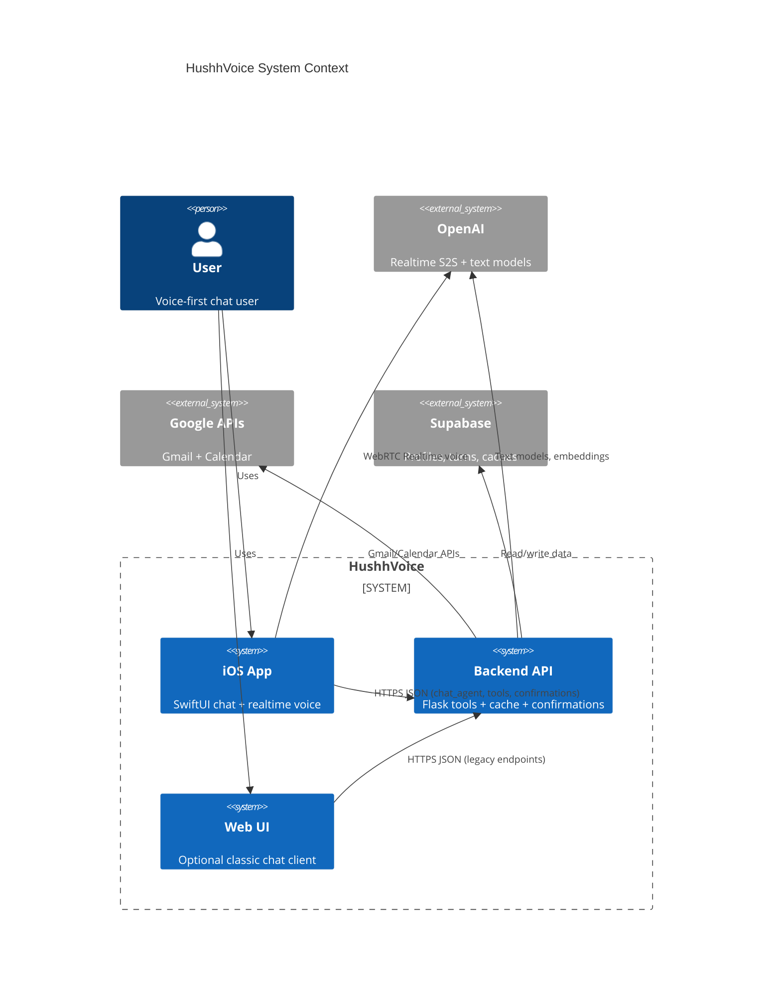
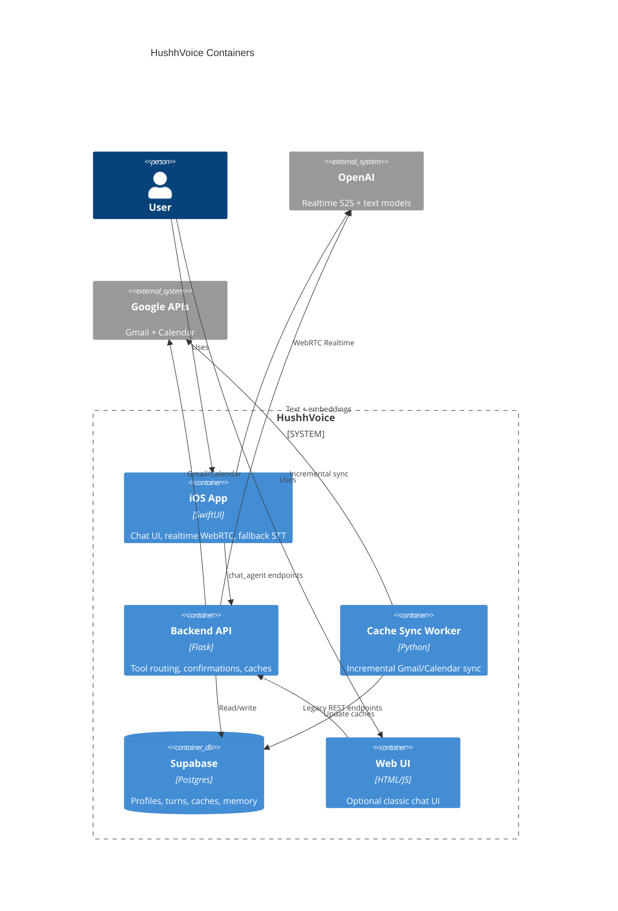
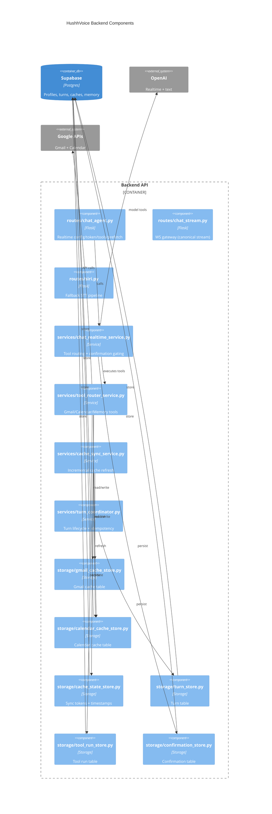
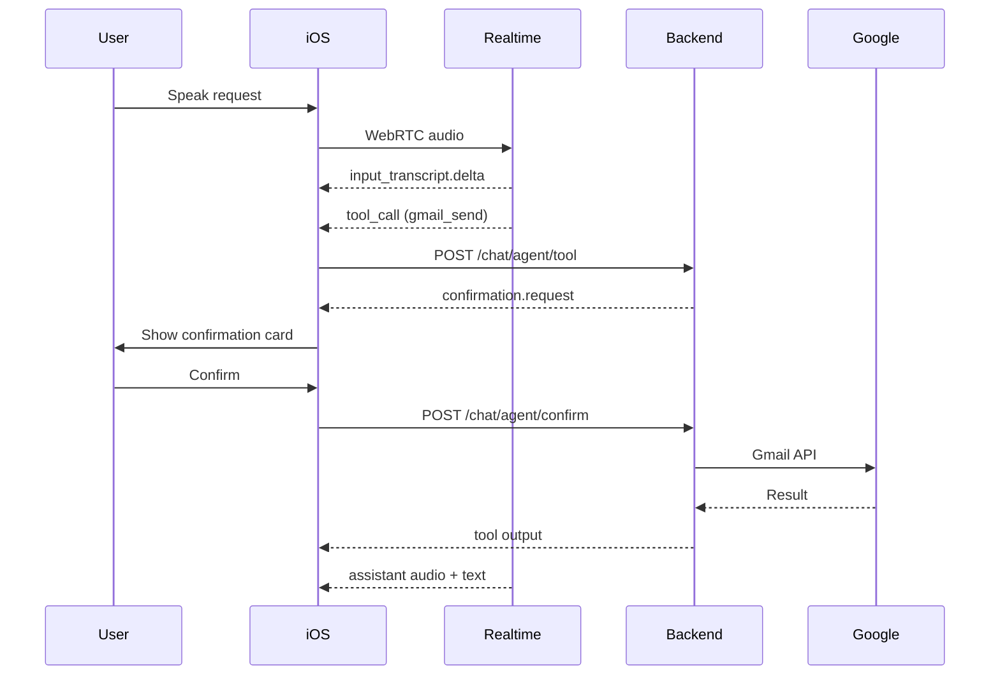

# HushhVoice Architecture (Current)

This document reflects the current codebase in `HushhVoice/` (backend) and `HushhVoice_v2/` (iOS).

## Scope and sources
- Backend: `api/*.py`, `backend/agents/*`
- iOS: `HushhVoice_v2/HushhVoice/HushhVoice/*.swift`
- Optional web UI: `frontend/*`

## System summary
- Single chat surface in iOS with realtime voice + streaming text.
- OpenAI Realtime (WebRTC) is the always-on voice shell when healthy.
- Backend remains the source of truth for tools, safety, confirmation gating, and caching.
- Gmail/Calendar reads are served from Supabase caches with incremental sync.
- Fallback path: on-device STT -> `/siri/ask` -> TTS (used only when realtime is unhealthy).

## Runtime flows

### 1) Realtime voice turn (primary path)
1. iOS calls `GET /chat/agent/config` for instructions + tools.
2. iOS calls `POST /chat/agent/token` for an ephemeral OpenAI Realtime token.
3. iOS opens WebRTC to OpenAI Realtime and sends `session.update`.
4. User speaks -> input transcript deltas -> UI draft bubble updates live.
5. Realtime model outputs assistant audio + transcript deltas -> UI streams text in sync.
6. If tools are needed, iOS forwards tool calls to `/chat/agent/tool`.
7. Backend executes read-through tools or asks for confirmation on writes.
8. On confirmation, iOS calls `/chat/agent/confirm`, tool executes, response continues.

### 2) Tool execution with cache
- Tool router checks Supabase caches first (`gmail_message_index`, `calendar_event_cache`).
- If cache is fresh, returns immediately and refreshes asynchronously.
- If cache is stale, triggers incremental sync using Gmail historyId or Calendar sync token.

### 3) Fallback STT path (only when realtime is unhealthy)
- iOS uses Apple Speech to capture user transcript.
- Text is sent to `/siri/ask` with Google access token if available.
- Backend runs tool router (Gmail/Calendar/Memory) and returns text.
- iOS speaks the reply via TTS.

## Application architecture

### iOS app (SwiftUI)
- `ChatView`: single chat surface, voice-first UI, streaming bubbles.
- `ChatRealtimeSession`: OpenAI Realtime WebRTC client + tool call forwarding.
- `AudioCaptureManager`: fallback STT input capture.
- `SpeechManager`: fallback TTS playback and streaming audio handling.
- `ChatStore`: local chat history, streaming state, confirmation UI.

### Backend (Flask)
- `routes/chat_agent.py`: config/token/tool/confirm/prefetch endpoints for realtime chat.
- `routes/chat_stream.py`: optional WS gateway for canonical events.
- `services/chat_realtime_service.py`: tool calling + confirmation gating + idempotency.
- `services/tool_router_service.py`: Gmail/Calendar/Memory tools with cache reads.
- `services/cache_sync_service.py`: incremental Gmail/Calendar cache updates.
- `services/orchestrator_service.py`: plan execution + parallel read-only tools.
- `services/turn_coordinator.py`: turn lifecycle tracking.
- `storage/*_store.py`: Supabase persistence (turns, tool_runs, confirmations, caches).

## Data architecture

### Supabase tables
- `kai_user_profile`
- `kai_onboarding_state`
- `sessions`
- `chat_turns`
- `tool_runs`
- `confirmation_requests`
- `memories`
- `gmail_message_index`
- `calendar_event_cache`
- `cache_state`
- `chat_threads` (optional)
- `chat_messages` (optional)
- `oauth_tokens` (optional)

### Cache strategy
- Gmail index is stored in `gmail_message_index` and refreshed incrementally using Gmail historyId.
- Calendar events are stored in `calendar_event_cache` and refreshed using sync tokens.
- `cache_state` stores `gmail_history_id`, `gmail_last_sync_ts`, `calendar_sync_token`, `calendar_last_sync_ts`.

## Security and trust boundaries
- OpenAI Realtime token is minted server-side and sent to iOS.
- Gmail/Calendar access tokens are passed from iOS to backend per request.
- All write actions require explicit confirmation.
- Supabase writes use the service role key on the backend.

## Observability
- `utils/debug_events.py` stores in-memory debug events.
- `utils/observability.py` logs turn lifecycle and cache events.

## C4 diagrams (mermaid)

### C1: System context

### C2: Container diagram

### C3: Backend components

### Sequence: realtime tool call with confirmation

