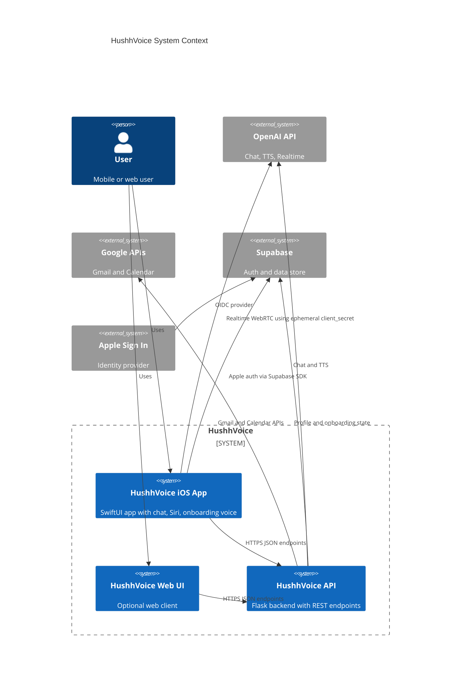
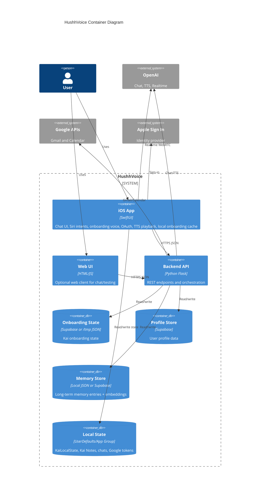
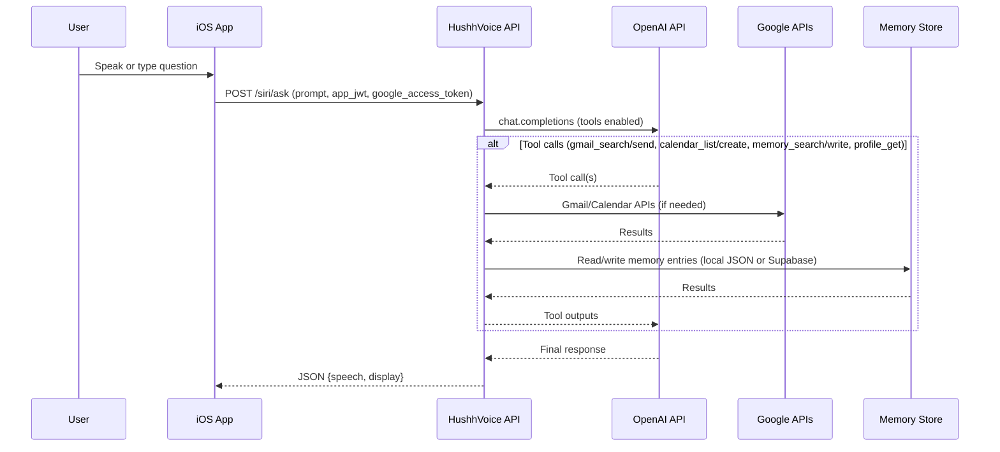
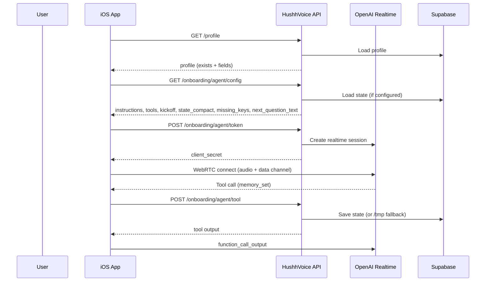
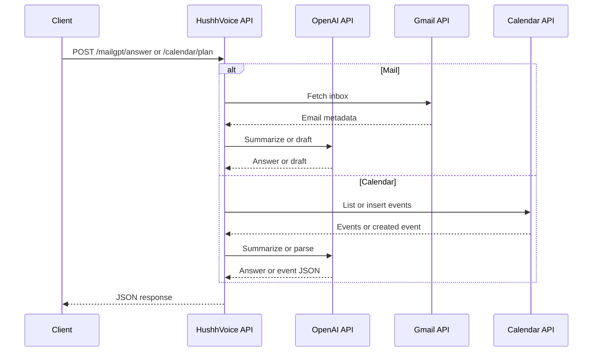
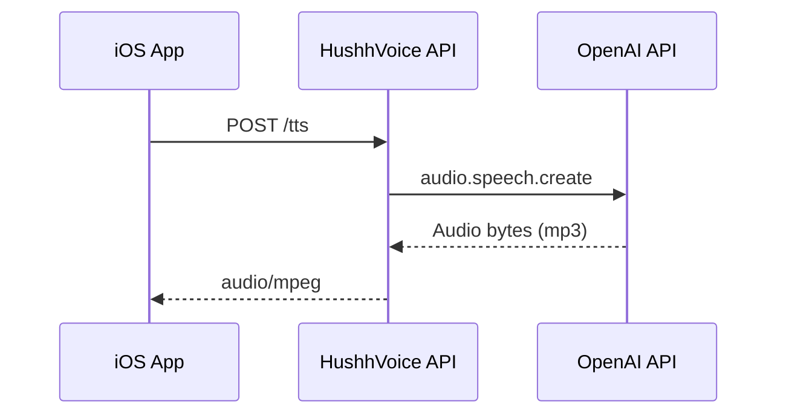
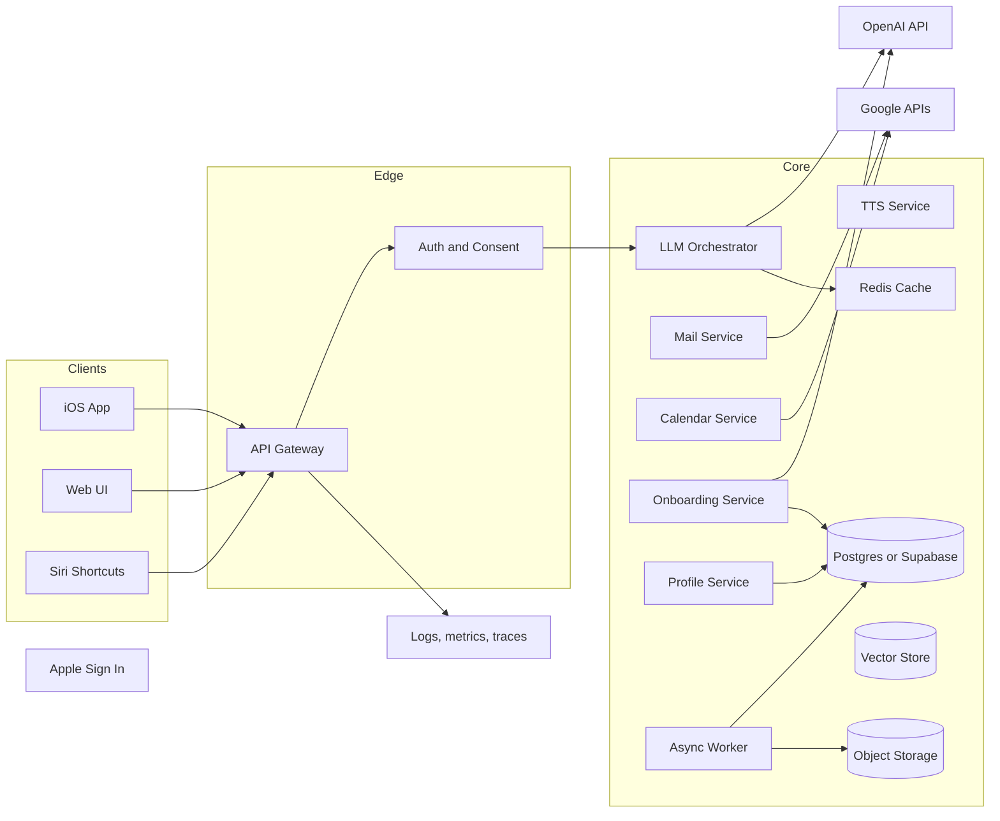

# HushhVoice Architecture

## Scope and sources
- Backend: `HushhVoice/api/*.py` and `HushhVoice/backend/agents/*`
- iOS app: `HushhVoice_v2/HushhVoice/HushhVoice/*.swift`
- Optional web UI: `HushhVoice/frontend/*`

This document captures the current architecture from code and recent updates and defines a target architecture aligned with TOGAF viewpoints and 12-factor principles.

## Business architecture (TOGAF)
### Stakeholders
- End users: chat, voice, Gmail/Calendar assistance, onboarding
- Product and operations: reliability, privacy, consent-first behavior
- External providers: OpenAI, Google, Supabase, Apple

### Business capabilities
- Conversational assistant (chat and Siri/Shortcuts)
- Gmail reading, summarization, and reply drafting/sending
- Google Calendar Q and A and scheduling
- Investor onboarding flow (Kai voice + summary review/edit)
- Kai Notes (per-answer highlights)
- Long-term memory capture/search (tool router)
- Profile capture and privacy-first identity enrichment
- Account deletion and local state reset

### Policies and constraints
- Consent-first, privacy-first messaging
- Do not request highly sensitive identifiers in onboarding flow
- External access tokens are provided by the client per request

## Application architecture (TOGAF)
### Logical components
- iOS app (SwiftUI): chat UI + multi-thread history, Siri Shortcuts (AppIntents), TTS playback, Google OAuth PKCE, Apple Sign In to Supabase, investor onboarding voice with OpenAI Realtime (WebRTC), summary editor, local UserDefaults cache and App Group token storage
- Backend API (Flask): REST endpoints for chat, mail, calendar, onboarding, profile, identity enrichment, TTS, debug console; tool router for /siri/ask (OpenAI tool calling)
- Memory service: local JSON store + optional Supabase store used by tool router (memory_search/memory_write)
- Agent modules: Gmail fetcher, reply drafting helper, (placeholder) health assistant
- Optional web UI: static HTML/CSS/JS client for chat and testing
- Third-party services: OpenAI (chat, embeddings, TTS, realtime), Google APIs (Gmail/Calendar), Supabase (profile/onboarding/memory), Apple Sign In

### Core backend routes (current)
- `GET /health`, `GET /version`
- `POST /echo`, `POST /echo/stream`
- `POST /intent/classify`
- `POST /siri/ask`
- `POST /mailgpt/answer`, `POST /mailgpt/reply`
- `POST /calendar/answer`, `POST /calendar/plan`
- `POST /tts`
- `GET /profile`, `POST /profile`
- `POST /account/delete`
- `GET /onboarding/agent/config`, `POST /onboarding/agent/token`, `POST /onboarding/agent/tool`, `POST /onboarding/agent/sync`, `GET /onboarding/agent/state`, `POST /onboarding/agent/reset`
- `POST /identity/enrich`
- `GET /debug`, `GET /debug/ui`, `GET /debug/events`, `POST /debug/clear`

### iOS onboarding flow (current)
- Stages: `loading` → `profile` → `intro1` → `intro2` → `meetKai` → `voice` → `summary` → `actions`
- On app open, iOS performs a single startup check:
  - `GET /profile?user_id=...`
  - `GET /onboarding/agent/config?user_id=...`
- Routing rules:
  - Profile incomplete → `profile`
  - Profile complete + onboarding incomplete → `intro1/intro2` (if not done) or `voice` (resume)
  - Profile complete + onboarding complete → exit onboarding (main app)
- User id resolution prefers Supabase Apple user id, then falls back to a local UUID stored as `hushh_kai_user_id`.
- Voice resume uses `next_question_text` and `missing_keys` from config and preserves local state while reconnecting WebRTC.
- “Go to HushhTech” routes to Summary if onboarding complete; otherwise routes to profile/intro/voice as needed.

### iOS UI highlights (current)
- Chat: multi-thread sidebar, typing animation, assistant streaming text, copy/TTS/reload actions
- Auth gate: logo orb with breathing animation, primary Google sign-in, Apple secondary, guest tertiary; trust copy without bank language
- Intro steps (1–4): premium glass cards, progress dots, logo orb on Steps 2 and 4
- Voice onboarding: Kai orb + waveform driven by mic level, muted state preserved, notes card capped + scrollable
- Kai Notes: newest entry animates only once, auto-scroll pinned during animation, notes stored per-answer
- Summary: hero grid with edit icon, highlight pills, accordion sections with confidence pills, sticky CTA + “Open HushhTech”

## Data architecture (TOGAF)
### Data domains
- User identity: Apple Sign In (Supabase user id) and a local Kai user id fallback (UUID)
- OAuth tokens: Google access + refresh tokens stored in App Group UserDefaults; web UI stores Google ID token in localStorage
- Conversation history: stored on device (UserDefaults `chats_v2` with `chat_history_v1` migration) and in web UI localStorage threads
- Onboarding state: local `KaiLocalState` per user id; backend stores `/tmp` JSON and optional Supabase state via `/onboarding/agent/sync`
- Profile data: Supabase table storing full_name, phone, email
- Memory store: local JSON + optional Supabase table storing embedding-backed entries (tool router)
- Supabase tables: `kai_onboarding_state`, `kai_user_profile`, `hushh_memory_store`
- Kai Notes: stored locally and optionally sourced from Supabase `notes_tail` via config
- Email and calendar data: transient, fetched on demand

### Data flows and storage
- iOS app stores Google tokens in App Group UserDefaults for reuse across app and Shortcuts
- Backend fetches Gmail and Calendar data using short-lived access tokens passed by the client
- Onboarding state is cached in memory, persisted locally in UserDefaults, and overwritten on app open by Supabase config when available
- Tool router memory uses local JSON by default and optionally syncs to Supabase (`hushh_memory_store`)
- Account deletion triggers `/account/delete` to remove Supabase rows and clears local onboarding/profile state on device
- Chat transcripts remain local-only; backend does not persist chat history by default

### Local persistence and sync (iOS)
- `KaiLocalState` (createdAt, discovery, notes, counts, isComplete, lastQuestionId) is encoded to JSON and stored under `hushh_kai_onboarding_state_v1_{user_id}`
- Sync pending is tracked via `hushh_kai_onboarding_sync_pending_{user_id}`; `hushh_kai_last_prompt` stores the last prompt for reconnect repeats
- On config fetch, iOS overwrites local discovery, counts, next question, and optionally notes from `notes_tail`
- Supabase sync is triggered after Summary is shown (or when pending); UI does not block on sync
- Chat threads are stored in `chats_v2` (legacy `chat_history_v1` is migrated)

## Technology architecture (TOGAF)
### Platforms and frameworks
- Backend: Python, Flask, OpenAI SDK (chat, responses, TTS, embeddings), requests, googleapiclient, Supabase REST
- iOS: SwiftUI, AppIntents, AVFoundation (AVAudioEngine mic level monitor + waveform), ASWebAuthenticationSession, Supabase SDK, LiveKitWebRTC, Orb
- Hosting: local run, gunicorn; ngrok for mobile testing

### Models in use (current)
- Chat: `gpt-4o`
- Intent classification: `gpt-4o-mini` (responses + function tool)
- Realtime voice: `gpt-4o-realtime-preview`
- Input transcription: `gpt-4o-mini-transcribe`
- TTS: `gpt-4o-mini-tts`
- Kai highlight summaries: `gpt-4.1-nano`
- Memory embeddings: `text-embedding-3-small`

### Security and trust boundaries
- App auth in `/siri/ask` is a placeholder JWT check (TODO in code)
- Google access tokens are supplied by client per request; optional Google ID token verification is gated by `VERIFY_GOOGLE_TOKEN`
- OpenAI Realtime uses an ephemeral client_secret generated by backend; SDP is exchanged directly with OpenAI
- Supabase service role key used server-side for onboarding/profile/memory writes
- Debug console endpoints are enabled only when `DEBUG_CONSOLE_ENABLED=true` (no auth layer yet)

## C4 architecture diagrams (mermaid)

### C1: System context

### C2: Container diagram

### C3: Component diagram (backend)

```mermaid
C4Component
title HushhVoice API Components (Flask)

Container_Boundary(api, "HushhVoice API") {
  Component(routes_meta, "routes/meta.py", "Flask routes", "/health, /version")
  Component(routes_echo, "routes/echo.py", "Flask routes", "/echo, /echo/stream")
  Component(routes_intent, "routes/intent.py", "Flask routes", "/intent/classify")
  Component(routes_siri, "routes/siri.py", "Flask routes", "/siri/ask")
  Component(routes_mail, "routes/mail.py", "Flask routes", "/mailgpt/*")
  Component(routes_calendar, "routes/calendar.py", "Flask routes", "/calendar/*")
  Component(routes_tts, "routes/tts.py", "Flask routes", "/tts")
  Component(routes_onboarding, "routes/onboarding.py", "Flask routes", "/onboarding/agent/*")
  Component(routes_profile, "routes/profile.py", "Flask routes", "/profile")
  Component(routes_account, "routes/account.py", "Flask routes", "/account/delete")
  Component(routes_identity, "routes/identity_enrich.py", "Flask routes", "/identity/enrich")
  Component(routes_debug, "routes/debug.py", "Flask routes", "/debug/*")

  Component(auth_helpers, "utils/auth_helpers.py", "Helper", "Token extraction/verification")
  Component(json_helpers, "utils/json_helpers.py", "Helper", "Response envelopes")
  Component(debug_events, "utils/debug_events.py", "Helper", "In-memory debug events")
  Component(openai_client, "clients/openai_client.py", "Client", "Chat/TTS wrapper")
  Component(google_client, "clients/google_client.py", "Client", "Calendar REST calls")

  Component(onboarding_service, "services/onboarding_service.py", "Service", "Onboarding orchestration")
  Component(profile_service, "services/profile_service.py", "Service", "Profile CRUD")
  Component(account_service, "services/account_service.py", "Service", "Account delete")
  Component(mail_service, "services/mail_service.py", "Service", "Mail QA + draft")
  Component(calendar_service, "services/calendar_service.py", "Service", "Calendar QA + plan")
  Component(intent_service, "services/intent_service.py", "Service", "Intent classification")
  Component(tool_router_service, "services/tool_router_service.py", "Service", "Siri tool router")
  Component(memory_service, "services/memory_service.py", "Service", "Embedding memory search/write")
  Component(tts_service, "services/tts_service.py", "Service", "TTS orchestration")

  Component(onboarding_state, "storage/onboarding_state_store.py", "Storage", "Cache + Supabase + disk")
  Component(memory_store, "storage/memory_store.py", "Storage", "Local JSON + Supabase memory")
  Component(profile_store, "storage/profile_store.py", "Storage", "Profile persistence")
  Component(supabase_store, "storage/supabase_store.py", "Storage", "Supabase REST helpers")

  Component(gmail_fetcher, "gmail_fetcher", "Agent module", "Gmail fetch/send")
  Component(reply_helper, "reply_helper", "Agent module", "Draft reply with OpenAI")
}

Container_Ext(openai, "OpenAI API", "Chat, TTS, Realtime")
Container_Ext(google, "Google APIs", "Gmail and Calendar")
ContainerDb(supabase, "Supabase", "Profile + onboarding + memory state")

Rel(routes_siri, tool_router_service, "Tool-routed assistant")
Rel(routes_intent, intent_service, "Intent classification")
Rel(routes_debug, debug_events, "List/clear events")
Rel(tool_router_service, openai_client, "Chat completions + tools")
Rel(tool_router_service, gmail_fetcher, "Gmail search/send")
Rel(tool_router_service, google_client, "Calendar REST")
Rel(tool_router_service, memory_service, "Memory search/write")
Rel(memory_service, memory_store, "Load/save entries")
Rel(memory_store, supabase_store, "Supabase REST")
Rel(routes_mail, mail_service, "Mail QA")
Rel(mail_service, gmail_fetcher, "Fetch/send Gmail")
Rel(mail_service, reply_helper, "Draft replies")
Rel(routes_calendar, calendar_service, "Calendar QA/plan")
Rel(calendar_service, google_client, "Calendar REST")
Rel(routes_onboarding, onboarding_service, "Onboarding flow")
Rel(onboarding_service, onboarding_state, "Load/save state")
Rel(onboarding_service, supabase_store, "Supabase state")
Rel(routes_profile, profile_service, "Profile CRUD")
Rel(profile_service, profile_store, "Profile persistence")
Rel(routes_account, account_service, "Account delete")
Rel(account_service, onboarding_state, "Clear onboarding state")
Rel(account_service, profile_store, "Clear profile")
Rel(account_service, supabase_store, "Supabase delete")

Rel(tts_service, openai_client, "TTS")
Rel(openai_client, openai, "Chat/TTS")
Rel(google_client, google, "Calendar")
Rel(gmail_fetcher, google, "Gmail")
Rel(onboarding_state, supabase, "State store")
Rel(memory_store, supabase, "Memory store")
Rel(routes_profile, supabase, "Profile store")
Rel(routes_identity, openai, "Inference")
```

## C4 dynamic workflows (mermaid)

### Siri ask flow

### Onboarding voice flow (Kai)

Notes:
- iOS updates local discovery, next_question_text, completed counts, and notes from tool output.
- Supabase sync is deferred until summary is shown.

### Mail and calendar (web or app)

### TTS flow

## 12-factor alignment (current vs target)
| Factor | Current state | Target state |
| --- | --- | --- |
| 1. Codebase | Single repo with backend and iOS | Keep mono-repo or split with clear ownership |
| 2. Dependencies | `requirements.txt` and Swift packages | Pin versions and use lockfiles where possible |
| 3. Config | `.env` plus environment variables | Move secrets out of code, use secret manager |
| 4. Backing services | OpenAI, Google, Supabase are attached | Keep them replaceable via config |
| 5. Build/release/run | Manual local run, gunicorn | CI/CD with build and release stages |
| 6. Processes | Some state in memory and `/tmp` | Make services stateless; persist in DB/Redis |
| 7. Port binding | `PORT` env supported | Keep |
| 8. Concurrency | Scale via gunicorn or serverless | Document process model and autoscale |
| 9. Disposability | No explicit shutdown handling | Add timeouts and graceful shutdown hooks |
| 10. Dev/prod parity | ngrok for dev | Use staging with same services |
| 11. Logs | Python logging to stdout | Structured logs + centralized aggregation |
| 12. Admin processes | None defined | Add one-off jobs (migrations, backfills) |

## Target architecture (ideal)
### Target principles
- Consent-first and privacy-first by default
- Zero trust between client and backend
- Stateless API services with durable data stores
- Event-driven for long-running tasks
- Observability as a first-class concern

### Target container view (proposed)

### Key changes from baseline
- Implement real app auth (JWT validation, session management, rate limiting)
- Move all onboarding and profile state to a durable database and add caching
- Add a token broker or vault for Google access and refresh tokens server-side
- Separate long-running AI tasks into background workers
- Add central observability, audit logs, and consent tracking
- Provide a stable environment separation for dev/staging/prod

## Gaps and risks observed in code
- App auth in `/siri/ask` is a placeholder and should be enforced
- Onboarding state falls back to `/tmp` storage if Supabase is not configured
- Memory store falls back to local JSON; durability and encryption depend on deployment
- Health assistant code is present but not wired into the API
- Onboarding resume depends on Supabase config availability; when offline, local cache is used and may drift from server state
- Realtime voice relies on short-lived client_secret tokens; token refresh failure results in reconnect and potential user interruption
- Debug console endpoints are unauthenticated when enabled
