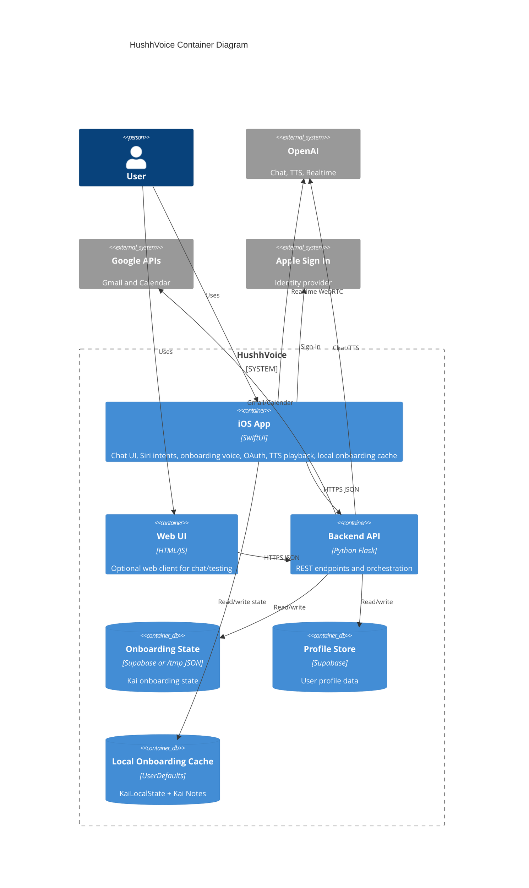
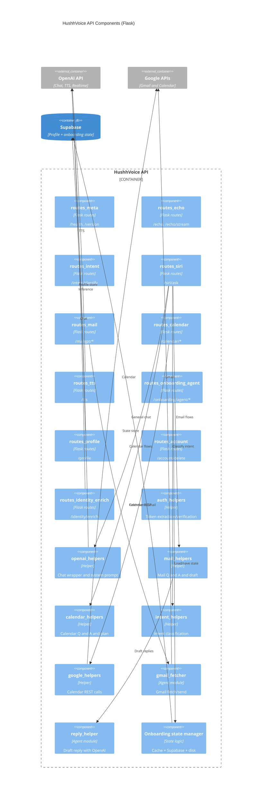

# HushhVoice Architecture

## Scope and sources
- Backend: `HushhVoice/api/*.py` and `HushhVoice/backend/agents/*`
- iOS app: `HushhVoice_v2/HushhVoice/HushhVoice/*.swift`
- Optional web UI: `HushhVoice/frontend/*`

This document captures the current architecture from code and recent updates and defines a target architecture aligned with TOGAF viewpoints and 12-factor principles.

## Business architecture (TOGAF)
### Stakeholders
- End users: chat, voice, Gmail/Calendar assistance, onboarding
- Product and operations: reliability, privacy, consent-first behavior
- External providers: OpenAI, Google, Supabase, Apple

### Business capabilities
- Conversational assistant (chat and voice)
- Siri and Shortcuts integration
- Gmail reading, summarization, and reply drafting/sending
- Google Calendar Q and A and scheduling
- Investor onboarding flow (Kai agent)
- Kai Notes (lightweight, per-answer summaries)
- Summary review and edit
- User profile capture and lightweight identity enrichment
- Account deletion and local state reset

### Policies and constraints
- Consent-first, privacy-first messaging
- Do not request highly sensitive identifiers in onboarding flow
- External access tokens are provided by the client per request

## Application architecture (TOGAF)
### Logical components
- iOS app (SwiftUI): chat UI, Siri Shortcuts, TTS playback, Google OAuth PKCE, Apple Sign In to Supabase, onboarding voice with OpenAI Realtime (WebRTC), onboarding resume from Supabase, premium onboarding UI (intro steps, Meet Kai, Summary)
- Backend API (Flask): REST endpoints for chat, mail, calendar, onboarding, profile, identity enrichment, TTS
- Agent modules: Gmail fetcher, reply drafting helper, (placeholder) health assistant
- Optional web UI: basic web client for chat and testing
- Third-party services: OpenAI (chat, TTS, realtime), Google APIs (Gmail/Calendar), Supabase (profile and onboarding state), Apple Sign In

### Core backend routes (current)
- `GET /health`, `GET /version`
- `POST /echo`, `POST /echo/stream`
- `POST /intent/classify`
- `POST /siri/ask`
- `POST /mailgpt/answer`, `POST /mailgpt/reply`
- `POST /calendar/answer`, `POST /calendar/plan`
- `POST /tts`
- `GET /profile`, `POST /profile`
- `POST /account/delete`
- `GET /onboarding/agent/config`, `POST /onboarding/agent/token`, `POST /onboarding/agent/tool`, `POST /onboarding/agent/sync`, `GET /onboarding/agent/state`, `POST /onboarding/agent/reset`
- `POST /identity/enrich`

### iOS onboarding flow (current)
- Stages: `loading` → `profile` → `intro1` → `intro2` → `meetKai` → `voice` → `summary` → `actions`
- On app open, iOS performs a single startup check:
  - `GET /profile?user_id=...`
  - `GET /onboarding/agent/config?user_id=...`
- Routing rules:
  - Profile incomplete → `profile`
  - Profile complete + onboarding incomplete → `intro1/intro2` (if not done) or `voice` (resume)
  - Profile complete + onboarding complete → exit onboarding (main app)
- Voice resume uses `next_question_text` and `missing_keys` from config and preserves local state while reconnecting WebRTC.
- “Go to HushhTech” routes to Summary first if onboarding complete; otherwise resumes onboarding.

### iOS UI highlights (current)
- Auth gate: logo orb with breathing animation, primary Google sign-in, Apple secondary, guest tertiary; trust copy without bank language
- Intro steps (1–4): premium glass cards, progress dots, logo orb on Steps 2 and 4
- Voice onboarding: Kai orb + waveform driven by mic level, muted state preserved, notes card capped + scrollable
- Kai Notes: newest entry animates only once, auto-scroll pinned during animation, notes stored per-answer
- Summary: hero grid with edit icon, highlight pills, accordion sections with confidence pills, sticky CTA + “Open HushhTech”

## Data architecture (TOGAF)
### Data domains
- User identity: Apple Sign In user id and Supabase user id
- OAuth tokens: Google access and refresh tokens (stored on device)
- Conversation history: stored on device (UserDefaults)
- Onboarding state: local persistent cache (UserDefaults JSON per user id) with Supabase as source of truth on app open; backend falls back to `/tmp` if Supabase is not configured
- Profile data: Supabase table storing name, phone, email
- Supabase tables: `kai_onboarding_state`, `kai_user_profile`
- Kai Notes: stored locally as an ordered list and optionally sourced from Supabase `notes_tail` via config
- Email and calendar data: transient, fetched on demand

### Data flows and storage
- iOS app stores Google tokens in App Group UserDefaults for reuse across app and Shortcuts
- Backend fetches Gmail and Calendar data using short-lived access tokens passed by the client
- Onboarding state is cached in memory, persisted locally in UserDefaults, and overwritten on app open by Supabase config when available
- Account deletion triggers `/account/delete` to remove Supabase rows and clears local onboarding/profile state on device
- No server-side long-term chat memory is currently persisted

### Local persistence and sync (iOS)
- `KaiLocalState` is encoded to JSON and stored in UserDefaults with key prefix `hushh_kai_onboarding_state_v1_{user_id}`
- Sync pending is tracked via a UserDefaults flag `hushh_kai_onboarding_sync_pending_{user_id}`
- On config fetch, iOS overwrites local discovery, counts, next question, and optionally notes from `notes_tail`
- Supabase sync is triggered after Summary is shown; UI does not block on sync

## Technology architecture (TOGAF)
### Platforms and frameworks
- Backend: Python, Flask, OpenAI SDK, requests, googleapiclient, Supabase REST
- iOS: SwiftUI, AppIntents, AVFoundation (AVAudioEngine mic level monitor + waveform), ASWebAuthenticationSession, Supabase SDK, LiveKitWebRTC, Orb
- Hosting: local run, gunicorn; ngrok for mobile testing

### Security and trust boundaries
- App auth in `/siri/ask` is a placeholder JWT check (TODO in code)
- Google access tokens are supplied by client per request
- OpenAI Realtime uses ephemeral client_secret generated by backend
- Supabase service role key used server-side for onboarding/profile writes

## C4 architecture diagrams (mermaid)

### C1: System context

### C2: Container diagram

### C3: Component diagram (backend)

## C4 dynamic workflows (mermaid)

### Siri ask flow

### Onboarding voice flow (Kai)

Notes:
- iOS updates local discovery, next_question_text, completed counts, and notes from tool output.
- Supabase sync is deferred until summary is shown.

### Mail and calendar (web or app)

### TTS flow

## 12-factor alignment (current vs target)
| Factor | Current state | Target state |
| --- | --- | --- |
| 1. Codebase | Single repo with backend and iOS | Keep mono-repo or split with clear ownership |
| 2. Dependencies | `requirements.txt` and Swift packages | Pin versions and use lockfiles where possible |
| 3. Config | `.env` plus environment variables | Move secrets out of code, use secret manager |
| 4. Backing services | OpenAI, Google, Supabase are attached | Keep them replaceable via config |
| 5. Build/release/run | Manual local run, gunicorn | CI/CD with build and release stages |
| 6. Processes | Some state in memory and `/tmp` | Make services stateless; persist in DB/Redis |
| 7. Port binding | `PORT` env supported | Keep |
| 8. Concurrency | Scale via gunicorn or serverless | Document process model and autoscale |
| 9. Disposability | No explicit shutdown handling | Add timeouts and graceful shutdown hooks |
| 10. Dev/prod parity | ngrok for dev | Use staging with same services |
| 11. Logs | Python logging to stdout | Structured logs + centralized aggregation |
| 12. Admin processes | None defined | Add one-off jobs (migrations, backfills) |

## Target architecture (ideal)
### Target principles
- Consent-first and privacy-first by default
- Zero trust between client and backend
- Stateless API services with durable data stores
- Event-driven for long-running tasks
- Observability as a first-class concern

### Target container view (proposed)

### Key changes from baseline
- Implement real app auth (JWT validation, session management, rate limiting)
- Move all onboarding and profile state to a durable database and add caching
- Add a token broker or vault for Google access and refresh tokens server-side
- Separate long-running AI tasks into background workers
- Add central observability, audit logs, and consent tracking
- Provide a stable environment separation for dev/staging/prod

## Gaps and risks observed in code
- App auth in `/siri/ask` is a placeholder and should be enforced
- Onboarding state falls back to `/tmp` storage if Supabase is not configured
- Health assistant code is present but not wired into the API
- Onboarding resume depends on Supabase config availability; when offline, local cache is used and may drift from server state
- Realtime voice relies on short-lived client_secret tokens; token refresh failure results in reconnect and potential user interruption
